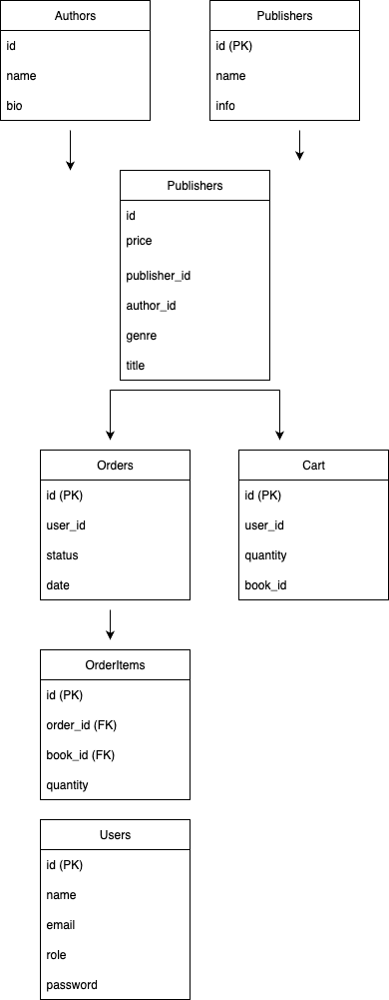

# Bookstore API

## Description  
REST API for an online bookstore. Users can browse books, authors, publishers, manage cart & orders. Admins can manage data.  

## Endpoints  
- `POST /api/register`, `POST /api/login`  
- `GET /api/books`, `GET /api/books/{id}`, `POST/PUT/DELETE /api/books` (admin)  
- `GET /api/authors`, `GET /api/authors/{id}`  
- `GET /api/publishers`, `GET /api/publishers/{id}`  
- `GET /api/cart`, `POST /api/cart/add`, `POST /api/orders`, `GET /api/orders`  
- `GET /api/profile`, `PUT /api/profile`  
- `GET /api/about`  

## Database Schema  
Users, Books, Authors, Publishers, Orders, OrderItems, Cart  

